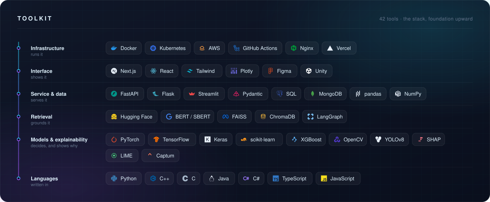

  

  
  
  
  
  

I build machine learning systems that can explain themselves, and the interfaces that make those explanations useful to someone who isn't an ML engineer.

Computer Science undergrad at **VIT Chennai** (AI & ML, class of 2027). I spent a summer at the **Indira Gandhi Centre for Atomic Research** replacing a manual industrial weld-inspection workflow with an end-to-end YOLOv8 pipeline, and presented a paper on automated AWS cost and security cleanup at **ICANDIT 2026**.

The through-line, whether it's a research notebook or a game engine: a system nobody can inspect is a system nobody should trust. So everything below ships with the model *and* the dashboard, the metric *and* the interface.

---

## Selected work
#### [Signal](https://github.com/mithinsagar/signal-resume-match) · most tools hand you a score, this one shows its work

Drop in a resume and a job posting, and Signal names every skill the role asks for, which of them the resume evidences, and exactly what each remaining gap costs. The deltas are measured, not estimated — the scorer is re-run with each missing skill injected to get them. A deterministic engine owns the number and a language model can only narrate a result it has no power to change, so the score is reproducible whether or not any model is reachable.

`Next.js 15` `TypeScript` `Tailwind CSS v4` `Groq` `unpdf` `Vitest`

 

#### [xai-attack-defense-framework](https://github.com/mithinsagar/xai-attack-defense-framework) · can you make an explanation lie?

An adversarial study of post-hoc explainability: can an attacker leave a security model's *prediction* untouched while corrupting the explanation the analyst reads? Across **235,795 phishing URLs**, an intrusion-detection set and a fraud corpus, four attacks on SHAP, LIME and Integrated Gradients say yes. Of the four defenses that follow, the hybrid one cuts mean explanation drift by **91.1%** while holding classification performance.

`PyTorch` `SHAP` `LIME` `Captum` `XGBoost` `scikit-learn` `pytest`

#### [EXAI-ResumeIntel](https://github.com/mithinsagar/EXAI-ResumeIntel) · explainable resume-to-role matching

Most ATS tools hand you a score. This one hands you the reasoning: Shapley values, LIME, counterfactuals and attention heatmaps that name the exact skills which earned the score, then price out what adding the missing ones is worth. Built on SBERT embeddings over **1M+ job postings** and **2,484 real resumes**, with the Shapley and LIME implementations written from first principles and 6 GB of model artifacts streamed from memory-mapped arrays.

`FastAPI` `Streamlit` `sentence-transformers` `scikit-learn` `Plotly` `Docker` `Kubernetes`

  

#### [FlashForensics AI](https://github.com/mithinsagar/flashforensics-ai) · agentic recovery for corrupted flash storage

Reads a damaged SD card sector by sector, rebuilds the files its index lost, and says which ones will actually open, with the evidence behind every verdict. It ships with a card it damages on purpose and a manifest of exactly what it did, so every run is graded against ground truth in the browser: **100% recall, zero false positives** across 25 planted files.

`Python` `FastAPI` `LangGraph` `ChromaDB` `Next.js` `TypeScript` `Docker`

 

#### [Society Maintenance Tracker](https://github.com/mithinsagar/society-maintenance-tracker) · complaint lifecycle and audit trail

Residents raise maintenance complaints with photos and follow them to resolution, while the committee triages through a strict OPEN → IN PROGRESS → RESOLVED workflow with priorities and configurable overdue detection. The audit trail is append-only and enforced at the database level, not merely in application code.

`Next.js 16` `TypeScript` `PostgreSQL` `Drizzle ORM` `Tailwind CSS` `Radix UI` `Vitest`

 

#### [StriderRunner](https://github.com/mithinsagar/StriderRunner-UnityGame) · a finished game, written like a library

Seven hand-built levels, nine movement abilities and fourteen trap behaviours, deliberately written as a clean reference codebase rather than a jam prototype. **47 C# files** across a four-layer architecture, where every playable character is a ScriptableObject, so adding one touches zero lines of code; Unity CI runs edit-mode and play-mode tests and ships Windows and WebGL builds on every push.

`Unity 2022 LTS` `C#` `Cinemachine` `Unity Input System` `GitHub Actions` `Git LFS`

---

## Toolkit

---

## How I build

Packages, not scripts: modules with clear boundaries you can swap or test in isolation. Configuration in YAML with typed dataclasses, not constants buried three files deep. Test suites that run without cloud credentials, a GPU or a 6 GB download, because a test nobody can run is documentation at best.

And sensible failure modes throughout: the RAG layer falls back to TF-IDF, the recommender falls back to rules, the explanation layer falls back to a template. And the tool that deletes cloud infrastructure won't do it unless you ask twice.

---

## Recognition

**Winner, Hack The Gap**, VIT Chennai (2025) · full-stack platform connecting underserved students to mentors, recognised for solution design and practical impact 
**First Runner-Up, Figma × Apple Vision Pro Design Challenge**, GDSC VIT Chennai (2023) · spatial-computing UI prototype 
**Paper presented, ICANDIT 2026**, INTI International University, Malaysia · *Automated AWS Resource Cleanup for Optimization of Cost and Security* 
**Outreach Head, TechnoVIT & Vibrance** (2024–25) · led a 25-member team across two flagship university festivals 
**Certifications** · Google UX Design Professional Certificate · Introduction to Generative AI, Google Cloud (100%) · Python Data Structures, University of Michigan (97.6%)

---

### Elsewhere

Away from the keyboard I shoot photography and play badminton. The photography is where most of my design instinct comes from: framing, hierarchy and knowing what to leave out of the frame turn out to be the same problem as designing an interface.

**Open to SDE and AI/ML roles.** The fastest way to reach me is [email](mailto:mithinsagar@gmail.com) or [LinkedIn](https://www.linkedin.com/in/mithinsagar).

 

  <picture>
    <source media="(prefers-color-scheme: dark)" srcset="https://raw.githubusercontent.com/mithinsagar/mithinsagar/output/snake-dark.svg" />
    <source media="(prefers-color-scheme: light)" srcset="https://raw.githubusercontent.com/mithinsagar/mithinsagar/output/snake.svg" />
    
  </picture>

